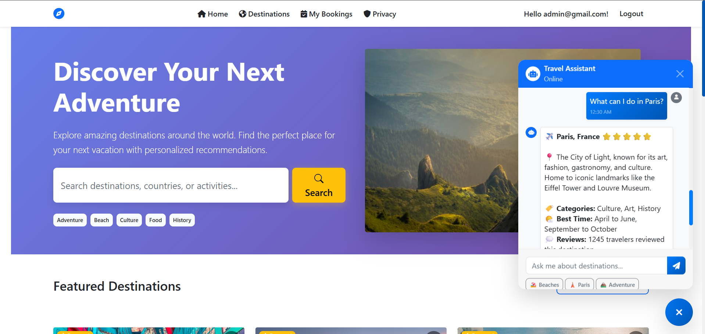
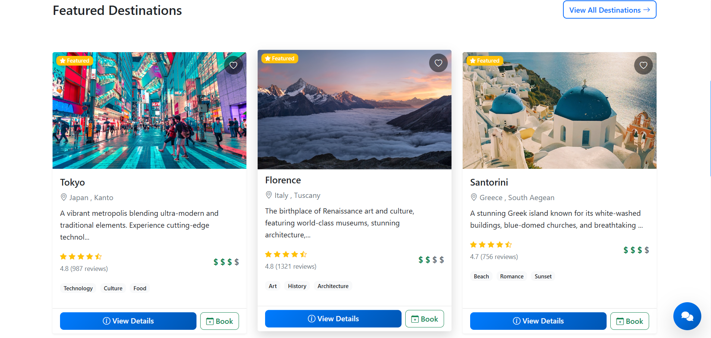
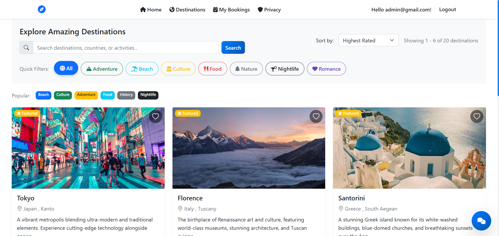
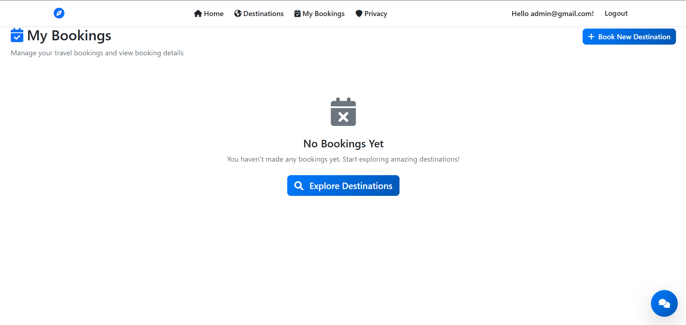
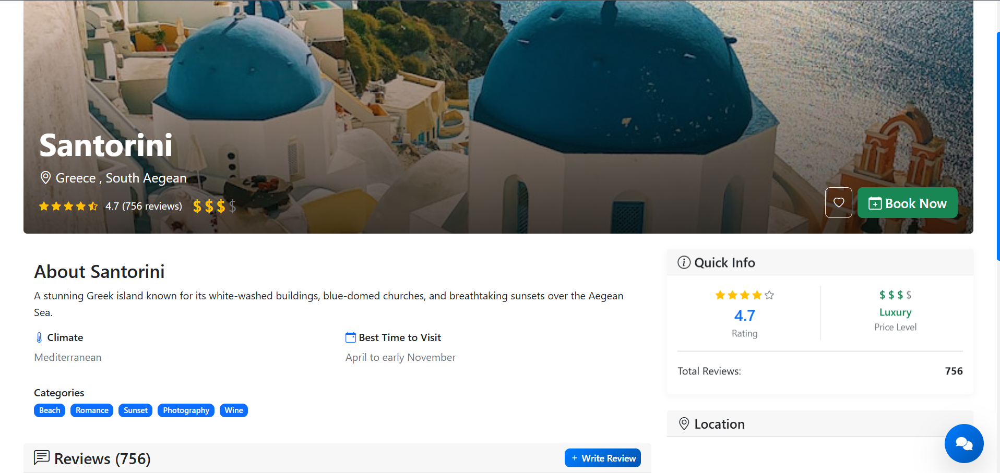
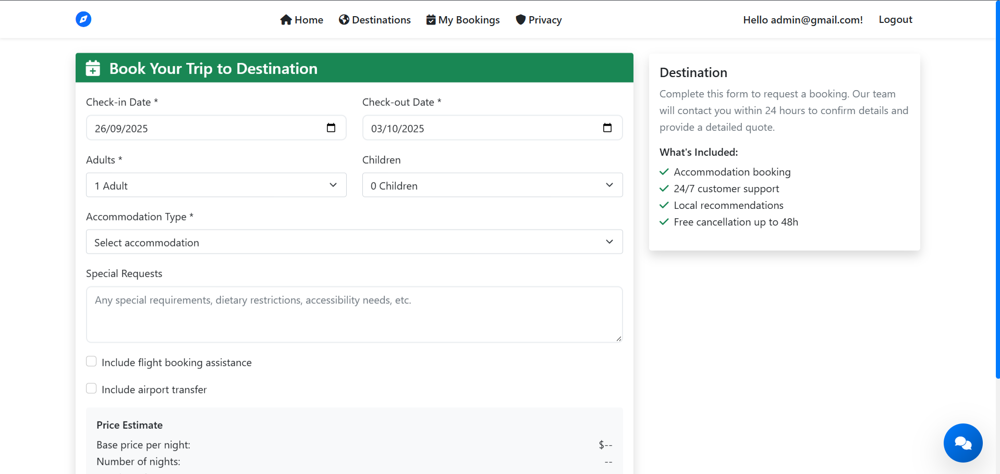

# Travel Recommendation System

A comprehensive web application where users can discover destinations, view attractions, read/write reviews, get personalized recommendations, and chat with an AI assistant for travel planning.

## Features
- **Travel Destinations**: Explore destinations from around the world including major European cities (Rome, Barcelona, Amsterdam, London...)
- **Smart Search**: Case-insensitive search for destinations by name, country, region, or tag with advanced filtering
- **Personalized Recommendations**: AI-powered recommendations using user preferences (budget, climate, duration, interests, travel style)
- **Destination Details**: Comprehensive pages with photos, ratings, 100+ tags, reviews, and interactive maps
- **User Management**: Registration, authentication, profile management, and booking system
- **Review System**: User reviews with ratings and helpful vote functionality  
- **AI Chatbot**: Interactive travel planning assistant with destination-specific knowledge
- **External API Integration**: Dynamic destination data from API-Ninjas and Geoapify services
- **Admin Panel**: Administrative interface for importing destinations from external APIs (/Admin)
- **Responsive Design**: Clean, modern UI with Bootstrap 5 and mobile-friendly layout

## Architecture
- **Framework**: ASP.NET Core 8.0 MVC with Clean Architecture
- **Database**: Entity Framework Core with SQLite
- **Authentication**: ASP.NET Core Identity
- **Frontend**: Razor Pages with Bootstrap 5, responsive design
- **External APIs**: API-Ninjas City API, Geoapify Places API
- **State Management**: Server-side with Entity Framework
- **Mapping**: Leaflet with OpenStreetMap integration

## Prerequisites
- .NET 8 SDK
- SQLite (bundled; no separate install required)

## Setup
1. Restore packages
   ```bash
   dotnet restore
   ```
2. Apply database migrations (creates local SQLite DB)
   ```bash
   dotnet ef database update
   ```

## Run
```bash
dotnet run
```
- App will start using the launch settings
  - HTTP: http://localhost:5072
  - HTTPS: https://localhost:7120

## Configuration
- App settings: `appsettings.json` and `appsettings.Development.json`
- Connection string defaults to a local SQLite file `TravelRecommendation.db`

## Navigation
- **Home**: Featured destinations and travel inspiration
- **Destinations**: Browse all 20 destinations with pagination (6 per page), search, and filtering
- **My Bookings**: Manage travel bookings and reservations (authenticated users)
- **Privacy**: Privacy policy and terms

## Admin Features
- Access admin panel at `/Admin` (requires admin role)
- Import destinations from external APIs
- Preview API data before importing
- Bulk import destinations by country

## Chatbot
- Open any page and use the chatbot widget
- Enter a destination (e.g., "Paris"). The chatbot replies with information about that destination and can assist with planning

## Maps
- Destination pages render an interactive map using Leaflet + OpenStreetMap, centered on the destination’s latitude/longitude

## API Configuration
- External API services are configured in `Services/DestinationApiService.cs`
- API keys can be updated for production use:
  - API-Ninjas: Replace `FREE_TRIAL` with your API key
  - Geoapify: Replace `FREE_TRIAL` with your API key
- Mock data is provided for demonstration when API keys are not configured

## Database
- SQLite database with 20 pre-seeded destinations
- 100+ destination tags for enhanced filtering
- Comprehensive seed data including attractions and sample bookings
- Database file: `TravelRecommendation.db` (auto-created)

## Troubleshooting
- If the app doesn’t start, ensure the database is created with `dotnet ef database update`
- If ports are in use, edit `Properties/launchSettings.json` to change `applicationUrl`
- For build errors, run `dotnet clean` then `dotnet build`

## License
This project is for educational/demo purposes.


Screenshots of the project:












